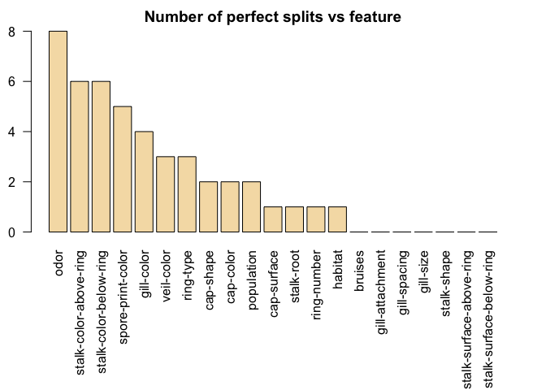
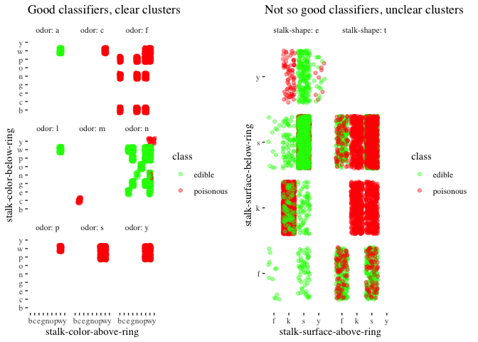
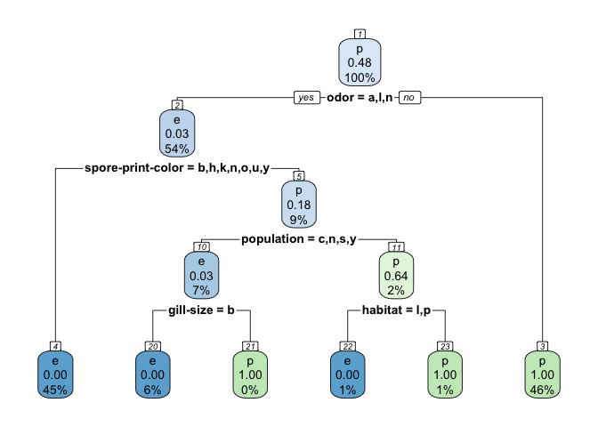
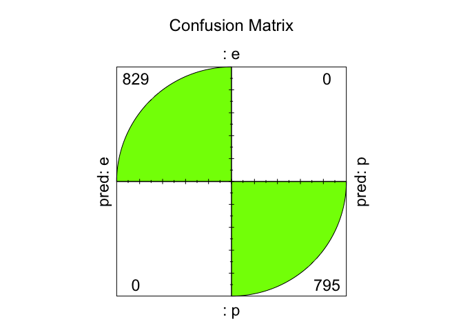

Module 2 Technique Practice: Decision Trees
================
Justin Ehringhaus
July 23, 2022

------------------------------------------------------------------------

``` r
library(pacman)
p_load(tidyverse)
p_load(ggthemes)
p_load(cowplot)
p_load(rpart)
p_load(caret)
p_load(rpart.plot)
p_load(rattle)
```

------------------------------------------------------------------------

``` r
#Reading the data set as a dataframe
mushrooms <- readxl::read_excel("/Users/justin/Desktop/ALY 6040/Homework/M2/Mushroom-Edibility-Decision-Tree/mushrooms.xlsx")

# structure of the data
str(mushrooms)
```

    ## tibble [8,124 × 23] (S3: tbl_df/tbl/data.frame)
    ##  $ class                   : chr [1:8124] "p" "e" "e" "p" ...
    ##  $ cap-shape               : chr [1:8124] "x" "x" "b" "x" ...
    ##  $ cap-surface             : chr [1:8124] "s" "s" "s" "y" ...
    ##  $ cap-color               : chr [1:8124] "n" "y" "w" "w" ...
    ##  $ bruises                 : chr [1:8124] "t" "t" "t" "t" ...
    ##  $ odor                    : chr [1:8124] "p" "a" "l" "p" ...
    ##  $ gill-attachment         : chr [1:8124] "f" "f" "f" "f" ...
    ##  $ gill-spacing            : chr [1:8124] "c" "c" "c" "c" ...
    ##  $ gill-size               : chr [1:8124] "n" "b" "b" "n" ...
    ##  $ gill-color              : chr [1:8124] "k" "k" "n" "n" ...
    ##  $ stalk-shape             : chr [1:8124] "e" "e" "e" "e" ...
    ##  $ stalk-root              : chr [1:8124] "e" "c" "c" "e" ...
    ##  $ stalk-surface-above-ring: chr [1:8124] "s" "s" "s" "s" ...
    ##  $ stalk-surface-below-ring: chr [1:8124] "s" "s" "s" "s" ...
    ##  $ stalk-color-above-ring  : chr [1:8124] "w" "w" "w" "w" ...
    ##  $ stalk-color-below-ring  : chr [1:8124] "w" "w" "w" "w" ...
    ##  $ veil-type               : chr [1:8124] "p" "p" "p" "p" ...
    ##  $ veil-color              : chr [1:8124] "w" "w" "w" "w" ...
    ##  $ ring-number             : chr [1:8124] "o" "o" "o" "o" ...
    ##  $ ring-type               : chr [1:8124] "p" "p" "p" "p" ...
    ##  $ spore-print-color       : chr [1:8124] "k" "n" "n" "k" ...
    ##  $ population              : chr [1:8124] "s" "n" "n" "s" ...
    ##  $ habitat                 : chr [1:8124] "u" "g" "m" "u" ...

``` r
# number of rows with missing values
nrow(mushrooms) - sum(complete.cases(mushrooms))
```

    ## [1] 0

``` r
# deleting redundant variable `veil.type`
mushrooms$`veil-type` <- NULL

# counting unique values for each column in mushrooms
lapply(mushrooms, table)
```

    ## $class
    ## 
    ##    e    p 
    ## 4208 3916 
    ## 
    ## $`cap-shape`
    ## 
    ##    b    c    f    k    s    x 
    ##  452    4 3152  828   32 3656 
    ## 
    ## $`cap-surface`
    ## 
    ##    f    g    s    y 
    ## 2320    4 2556 3244 
    ## 
    ## $`cap-color`
    ## 
    ##    b    c    e    g    n    p    r    u    w    y 
    ##  168   44 1500 1840 2284  144   16   16 1040 1072 
    ## 
    ## $bruises
    ## 
    ##    f    t 
    ## 4748 3376 
    ## 
    ## $odor
    ## 
    ##    a    c    f    l    m    n    p    s    y 
    ##  400  192 2160  400   36 3528  256  576  576 
    ## 
    ## $`gill-attachment`
    ## 
    ##    a    f 
    ##  210 7914 
    ## 
    ## $`gill-spacing`
    ## 
    ##    c    w 
    ## 6812 1312 
    ## 
    ## $`gill-size`
    ## 
    ##    b    n 
    ## 5612 2512 
    ## 
    ## $`gill-color`
    ## 
    ##    b    e    g    h    k    n    o    p    r    u    w    y 
    ## 1728   96  752  732  408 1048   64 1492   24  492 1202   86 
    ## 
    ## $`stalk-shape`
    ## 
    ##    e    t 
    ## 3516 4608 
    ## 
    ## $`stalk-root`
    ## 
    ##    ?    b    c    e    r 
    ## 2480 3776  556 1120  192 
    ## 
    ## $`stalk-surface-above-ring`
    ## 
    ##    f    k    s    y 
    ##  552 2372 5176   24 
    ## 
    ## $`stalk-surface-below-ring`
    ## 
    ##    f    k    s    y 
    ##  600 2304 4936  284 
    ## 
    ## $`stalk-color-above-ring`
    ## 
    ##    b    c    e    g    n    o    p    w    y 
    ##  432   36   96  576  448  192 1872 4464    8 
    ## 
    ## $`stalk-color-below-ring`
    ## 
    ##    b    c    e    g    n    o    p    w    y 
    ##  432   36   96  576  512  192 1872 4384   24 
    ## 
    ## $`veil-color`
    ## 
    ##    n    o    w    y 
    ##   96   96 7924    8 
    ## 
    ## $`ring-number`
    ## 
    ##    n    o    t 
    ##   36 7488  600 
    ## 
    ## $`ring-type`
    ## 
    ##    e    f    l    n    p 
    ## 2776   48 1296   36 3968 
    ## 
    ## $`spore-print-color`
    ## 
    ##    b    h    k    n    o    r    u    w    y 
    ##   48 1632 1872 1968   48   72   48 2388   48 
    ## 
    ## $population
    ## 
    ##    a    c    n    s    v    y 
    ##  384  340  400 1248 4040 1712 
    ## 
    ## $habitat
    ## 
    ##    d    g    l    m    p    u    w 
    ## 3148 2148  832  292 1144  368  192

The mushrooms dataset is comprised entirely of categorical character
variables, and there are zero missing values. Although lacking a data
dictionary, the letters appear to lack order, and thus we can assume the
categorical data is nominal as opposed to ordinal. For instance, the
`class` variable likely refers to edible (e) and poisonous (p).
Furthermore, counting the unique values from each variable reveals a
significant number of entries for each unique value, and thus we can
assume there are no data entry errors or outliers in the dataset. No
further cleaning of the data is necessary.

``` r
#analyzing the odor variable
table(mushrooms$class, mushrooms$odor)
```

    ##    
    ##        a    c    f    l    m    n    p    s    y
    ##   e  400    0    0  400    0 3408    0    0    0
    ##   p    0  192 2160    0   36  120  256  576  576

The table above counts the number of edible versus poisonous mushrooms
by type of odor. Odor appears to be a nearly perfect indicator of
edibility, and it is only in the case of `odor = n` where edibility is
slightly ambiguous. Thus, using `odor` will likely be an important
classifier of `class` when building a model, as it can be used to reduce
entropy and maximize information gain because of the many instances of
perfect splits, where the particular odor perfectly indicates edibility.

``` r
number.perfect.splits <- apply(X = mushrooms[-1], MARGIN = 2, FUN = function(col) {
  t <- table(mushrooms$class, col)
  sum(t == 0)
})

# Descending order of perfect splits
order <- order(number.perfect.splits, decreasing = TRUE)
number.perfect.splits <- number.perfect.splits[order]
number.perfect.splits
```

    ##                     odor   stalk-color-above-ring   stalk-color-below-ring 
    ##                        8                        6                        6 
    ##        spore-print-color               gill-color               veil-color 
    ##                        5                        4                        3 
    ##                ring-type                cap-shape                cap-color 
    ##                        3                        2                        2 
    ##               population              cap-surface               stalk-root 
    ##                        2                        1                        1 
    ##              ring-number                  habitat                  bruises 
    ##                        1                        1                        0 
    ##          gill-attachment             gill-spacing                gill-size 
    ##                        0                        0                        0 
    ##              stalk-shape stalk-surface-above-ring stalk-surface-below-ring 
    ##                        0                        0                        0

``` r
# Plot graph
par(mar = c(10,2,2,2))
barplot(number.perfect.splits,
        main = "Number of perfect splits vs feature",
        xlab = "", ylab = "Feature", las = 2, col = "wheat")
```

<!-- -->

`number.perfect.splits` and the accompanying visualization confirms our
hypothesis above. `odor` is not only a great indicator of edibility
(`class`), it is the best classifier of edibility among the variables in
our dataset. `odor` contains 8 perfect splits out of 9 unique values.

``` r
best_splits_visualized <- 
  mushrooms %>% 
  ggplot +
  aes(`stalk-color-above-ring`, `stalk-color-below-ring`, color = `class`) +
  geom_jitter(alpha = 0.4, position = "jitter") +
  facet_wrap(~ odor, labeller = label_both) +
  scale_color_manual(labels = c('edible', 'poisonous'),
                     values = c("green", "red")) +
  labs(
    title = "Good classifiers, clear clusters"
  ) +
  theme_tufte()

worst_splits_visualized <- 
  mushrooms %>% 
  ggplot +
  aes(`stalk-surface-above-ring`, `stalk-surface-below-ring`, color = `class`) +
  geom_jitter(alpha = 0.4, position = "jitter") +
  facet_wrap(~ `stalk-shape`, labeller = label_both) +
  scale_color_manual(labels = c('edible', 'poisonous'),
                     values = c("green", "red")) +
  labs(
    title = "Not so good classifiers, unclear clusters"
  ) +
  theme_tufte()

plot_grid(best_splits_visualized,
          worst_splits_visualized)
```

<!-- -->

To visually examine how certain variables are better at classifying
`class` than other variables, we can examine how clusters of edible and
poisonous mushrooms when comparing variables against each other. The
plot on the left examines variables that contain many instances of
perfect splits (i.e., good classifiers), whereas the plot on the right
examines variables that contain few, or zero, instances of perfect
splits (i.e., bad classifiers). The left plot illustrates how clusters
of edible mushrooms versus poisonous mushrooms are easily
distinguishable, whereas the right plot illustrates how there is a lot
of overlap and ambiguity between poisonous and non-poisonous mushrooms.

``` r
#data splicing
set.seed(12345)
train <- sample(1:nrow(mushrooms), size = ceiling(0.80 * nrow(mushrooms)), replace = FALSE)
# training set
mushrooms_train <- mushrooms[train,]
# test set
mushrooms_test <- mushrooms[-train,]

nrow(mushrooms_train)
```

    ## [1] 6500

``` r
nrow(mushrooms_test)
```

    ## [1] 1624

80% of the data has randomly been placed into a training set and 20%
into a test set. The training set will be used to create a decision
tree, and the test set will be used to test the resulting model’s
accuracy.

``` r
# penalty matrix
penalty.matrix <- matrix(c(0, 1, 10, 0), byrow = TRUE, nrow = 2)

# building the classification tree with rpart
tree <- rpart(formula = class ~ .,
              data = mushrooms_train,
              parms = list(loss = penalty.matrix),
              method = "class")

# Details of the decision tree
summary(tree)
```

    ## Call:
    ## rpart(formula = class ~ ., data = mushrooms_train, method = "class", 
    ##     parms = list(loss = penalty.matrix))
    ##   n= 6500 
    ## 
    ##           CP nsplit  rel error       xerror         xstd
    ## 1 0.70701391      0 1.00000000 1.000000e+01 0.1192054496
    ## 2 0.15596330      1 0.29298609 2.929861e-02 0.0029221105
    ## 3 0.08671204      2 0.13702279 1.131400e+00 0.0560459358
    ## 4 0.03551347      3 0.05031074 1.535957e-01 0.0210674150
    ## 5 0.01479728      4 0.01479728 1.515241e-01 0.0210551689
    ## 6 0.01000000      5 0.00000000 5.918911e-04 0.0004184658
    ## 
    ## Variable importance
    ##                     odor        spore-print-color stalk-surface-above-ring 
    ##                       20                       19                       12 
    ##               gill-color stalk-surface-below-ring                ring-type 
    ##                       12                       11                       11 
    ##              ring-number               stalk-root                  habitat 
    ##                        4                        3                        2 
    ##   stalk-color-below-ring               population                gill-size 
    ##                        2                        2                        1 
    ##                cap-color 
    ##                        1 
    ## 
    ## Node number 1: 6500 observations,    complexity param=0.7070139
    ##   predicted class=p  expected loss=0.5198462  P(node) =1
    ##     class counts:  3379  3121
    ##    probabilities: 0.520 0.480 
    ##   left son=2 (3478 obs) right son=3 (3022 obs)
    ##   Primary splits:
    ##       odor                   splits as  LRRLRLRRR,    improve=858.1360, (0 missing)
    ##       spore-print-color      splits as  LRLLLRLRL,    improve=356.4209, (0 missing)
    ##       stalk-color-above-ring splits as  RRLLRLRRR,    improve=220.8540, (0 missing)
    ##       stalk-color-below-ring splits as  RRLLRLRRR,    improve=214.7983, (0 missing)
    ##       gill-color             splits as  RLRRLLLRRLLL, improve=209.7191, (0 missing)
    ##   Surrogate splits:
    ##       spore-print-color        splits as  LRLLLLLRL,    agree=0.861, adj=0.702, (0 split)
    ##       gill-color               splits as  RLRRLLLLLLLL, agree=0.806, adj=0.583, (0 split)
    ##       stalk-surface-below-ring splits as  LRLL,         agree=0.782, adj=0.531, (0 split)
    ##       ring-type                splits as  RLRRL,        agree=0.780, adj=0.527, (0 split)
    ##       stalk-surface-above-ring splits as  LRLL,         agree=0.779, adj=0.524, (0 split)
    ## 
    ## Node number 2: 3478 observations,    complexity param=0.1559633
    ##   predicted class=e  expected loss=0.2846463  P(node) =0.5350769
    ##     class counts:  3379    99
    ##    probabilities: 0.972 0.028 
    ##   left son=4 (2916 obs) right son=5 (562 obs)
    ##   Primary splits:
    ##       spore-print-color splits as  LLLLLRLRL,    improve=169.20590, (0 missing)
    ##       gill-color        splits as  -LRLLLLLRLRR, improve= 96.52309, (0 missing)
    ##       population        splits as  LRLLRL,       improve= 84.04310, (0 missing)
    ##       cap-color         splits as  RLLLLRLLLL,   improve= 77.98737, (0 missing)
    ##       stalk-shape       splits as  RL,           improve= 75.70575, (0 missing)
    ##   Surrogate splits:
    ##       ring-number              splits as  -LR,       agree=0.979, adj=0.870, (0 split)
    ##       stalk-root               splits as  RLLLL,     agree=0.899, adj=0.375, (0 split)
    ##       stalk-surface-above-ring splits as  LRLR,      agree=0.887, adj=0.302, (0 split)
    ##       stalk-color-below-ring   splits as  --RLRLLLR, agree=0.882, adj=0.270, (0 split)
    ##       habitat                  splits as  LLLLLLR,   agree=0.881, adj=0.263, (0 split)
    ## 
    ## Node number 3: 3022 observations
    ##   predicted class=p  expected loss=0  P(node) =0.4649231
    ##     class counts:     0  3022
    ##    probabilities: 0.000 1.000 
    ## 
    ## Node number 4: 2916 observations
    ##   predicted class=e  expected loss=0  P(node) =0.4486154
    ##     class counts:  2916     0
    ##    probabilities: 1.000 0.000 
    ## 
    ## Node number 5: 562 observations,    complexity param=0.08671204
    ##   predicted class=p  expected loss=0.8238434  P(node) =0.08646154
    ##     class counts:   463    99
    ##    probabilities: 0.824 0.176 
    ##   left son=10 (425 obs) right son=11 (137 obs)
    ##   Primary splits:
    ##       population        splits as  -LLLRL,     improve=65.84709, (0 missing)
    ##       spore-print-color splits as  -----R-L-,  improve=41.27132, (0 missing)
    ##       cap-color         splits as  RLLLRR--RR, improve=38.60080, (0 missing)
    ##       habitat           splits as  RLRRL-L,    improve=36.06693, (0 missing)
    ##       stalk-root        splits as  LRR--,      improve=35.57689, (0 missing)
    ##   Surrogate splits:
    ##       stalk-root        splits as  LRL--,     agree=0.900, adj=0.591, (0 split)
    ##       habitat           splits as  RLRRL-L,   agree=0.884, adj=0.526, (0 split)
    ##       spore-print-color splits as  -----R-L-, agree=0.867, adj=0.453, (0 split)
    ##       gill-size         splits as  LR,        agree=0.843, adj=0.358, (0 split)
    ##       ring-number       splits as  -RL,       agree=0.843, adj=0.358, (0 split)
    ## 
    ## Node number 10: 425 observations,    complexity param=0.03551347
    ##   predicted class=e  expected loss=0.2823529  P(node) =0.06538462
    ##     class counts:   413    12
    ##    probabilities: 0.972 0.028 
    ##   left son=20 (413 obs) right son=21 (12 obs)
    ##   Primary splits:
    ##       gill-size   splits as  LR,         improve=34.94696, (0 missing)
    ##       ring-number splits as  -RL,        improve=34.94696, (0 missing)
    ##       habitat     splits as  LLR-L-L,    improve=34.94696, (0 missing)
    ##       stalk-root  splits as  LRR--,      improve=26.91527, (0 missing)
    ##       cap-color   splits as  LLLLLL--LR, improve=18.18425, (0 missing)
    ##   Surrogate splits:
    ##       cap-color              splits as  LLLLLL--LR, agree=0.988, adj=0.583, (0 split)
    ##       stalk-root             splits as  LLR--,      agree=0.988, adj=0.583, (0 split)
    ##       stalk-color-above-ring splits as  --L-L--LR,  agree=0.988, adj=0.583, (0 split)
    ##       stalk-color-below-ring splits as  --L-L--LR,  agree=0.988, adj=0.583, (0 split)
    ##       veil-color             splits as  --LR,       agree=0.988, adj=0.583, (0 split)
    ## 
    ## Node number 11: 137 observations,    complexity param=0.01479728
    ##   predicted class=p  expected loss=0.3649635  P(node) =0.02107692
    ##     class counts:    50    87
    ##    probabilities: 0.365 0.635 
    ##   left son=22 (50 obs) right son=23 (87 obs)
    ##   Primary splits:
    ##       habitat                  splits as  RRLRL--,    improve=17.770790, (0 missing)
    ##       gill-spacing             splits as  RL,         improve=12.592330, (0 missing)
    ##       cap-color                splits as  RL-LRR--RR, improve= 9.349068, (0 missing)
    ##       stalk-surface-below-ring splits as  L-RR,       improve= 6.170523, (0 missing)
    ##       stalk-surface-above-ring splits as  LRR-,       improve= 5.472775, (0 missing)
    ##   Surrogate splits:
    ##       cap-color              splits as  RL-LLR--RR, agree=0.898, adj=0.72, (0 split)
    ##       gill-spacing           splits as  RL,         agree=0.898, adj=0.72, (0 split)
    ##       spore-print-color      splits as  -----R-L-,  agree=0.818, adj=0.50, (0 split)
    ##       stalk-color-below-ring splits as  ----L--RR,  agree=0.810, adj=0.48, (0 split)
    ##       cap-shape              splits as  R-RL-L,     agree=0.766, adj=0.36, (0 split)
    ## 
    ## Node number 20: 413 observations
    ##   predicted class=e  expected loss=0  P(node) =0.06353846
    ##     class counts:   413     0
    ##    probabilities: 1.000 0.000 
    ## 
    ## Node number 21: 12 observations
    ##   predicted class=p  expected loss=0  P(node) =0.001846154
    ##     class counts:     0    12
    ##    probabilities: 0.000 1.000 
    ## 
    ## Node number 22: 50 observations
    ##   predicted class=e  expected loss=0  P(node) =0.007692308
    ##     class counts:    50     0
    ##    probabilities: 1.000 0.000 
    ## 
    ## Node number 23: 87 observations
    ##   predicted class=p  expected loss=0  P(node) =0.01338462
    ##     class counts:     0    87
    ##    probabilities: 0.000 1.000

``` r
# Visualize the decision tree with rpart.plot
rpart.plot(tree, nn = TRUE)
```

<!-- -->

The `rpart` function (Therneau, Atkinson, and Foundation 2022) built a
model separating mushrooms into six groups, and many variables in the
dataset do not appear in the resultant model as they were not deemed
important enough for classifying the `class` variable. `odor` was used
in Node 1 as the best classifier for splitting the data into two groups
just as we had manually discovered in our exploration of best splits
above. Having split the data by `odor`, the next best classifiers are
found for each resulting subgroup. This process repeats recursively
until no further splitting is possible or necessary.

The major question to ask of such a model is whether it is too complex,
too specific, or too sensitive. In other words, did the recursive
process of splitting the data into groups and subgroups continue on for
too long. When should the splitting stop? In the next step, we will
adjust the complexity parameter to prune the tree in an attempt to
simplify the model.

``` r
# choosing the best complexity parameter "cp" to prune the tree
cp.optim <- tree$cptable[which.min(tree$cptable[,"xerror"]), "CP"]

# tree prunning using the best complexity parameter
tree <- prune(tree, cp = cp.optim)

# Details of the pruned decision tree
summary(tree)
```

    ## Call:
    ## rpart(formula = class ~ ., data = mushrooms_train, method = "class", 
    ##     parms = list(loss = penalty.matrix))
    ##   n= 6500 
    ## 
    ##           CP nsplit  rel error       xerror         xstd
    ## 1 0.70701391      0 1.00000000 1.000000e+01 0.1192054496
    ## 2 0.15596330      1 0.29298609 2.929861e-02 0.0029221105
    ## 3 0.08671204      2 0.13702279 1.131400e+00 0.0560459358
    ## 4 0.03551347      3 0.05031074 1.535957e-01 0.0210674150
    ## 5 0.01479728      4 0.01479728 1.515241e-01 0.0210551689
    ## 6 0.01000000      5 0.00000000 5.918911e-04 0.0004184658
    ## 
    ## Variable importance
    ##                     odor        spore-print-color stalk-surface-above-ring 
    ##                       20                       19                       12 
    ##               gill-color stalk-surface-below-ring                ring-type 
    ##                       12                       11                       11 
    ##              ring-number               stalk-root                  habitat 
    ##                        4                        3                        2 
    ##   stalk-color-below-ring               population                gill-size 
    ##                        2                        2                        1 
    ##                cap-color 
    ##                        1 
    ## 
    ## Node number 1: 6500 observations,    complexity param=0.7070139
    ##   predicted class=p  expected loss=0.5198462  P(node) =1
    ##     class counts:  3379  3121
    ##    probabilities: 0.520 0.480 
    ##   left son=2 (3478 obs) right son=3 (3022 obs)
    ##   Primary splits:
    ##       odor                   splits as  LRRLRLRRR,    improve=858.1360, (0 missing)
    ##       spore-print-color      splits as  LRLLLRLRL,    improve=356.4209, (0 missing)
    ##       stalk-color-above-ring splits as  RRLLRLRRR,    improve=220.8540, (0 missing)
    ##       stalk-color-below-ring splits as  RRLLRLRRR,    improve=214.7983, (0 missing)
    ##       gill-color             splits as  RLRRLLLRRLLL, improve=209.7191, (0 missing)
    ##   Surrogate splits:
    ##       spore-print-color        splits as  LRLLLLLRL,    agree=0.861, adj=0.702, (0 split)
    ##       gill-color               splits as  RLRRLLLLLLLL, agree=0.806, adj=0.583, (0 split)
    ##       stalk-surface-below-ring splits as  LRLL,         agree=0.782, adj=0.531, (0 split)
    ##       ring-type                splits as  RLRRL,        agree=0.780, adj=0.527, (0 split)
    ##       stalk-surface-above-ring splits as  LRLL,         agree=0.779, adj=0.524, (0 split)
    ## 
    ## Node number 2: 3478 observations,    complexity param=0.1559633
    ##   predicted class=e  expected loss=0.2846463  P(node) =0.5350769
    ##     class counts:  3379    99
    ##    probabilities: 0.972 0.028 
    ##   left son=4 (2916 obs) right son=5 (562 obs)
    ##   Primary splits:
    ##       spore-print-color splits as  LLLLLRLRL,    improve=169.20590, (0 missing)
    ##       gill-color        splits as  -LRLLLLLRLRR, improve= 96.52309, (0 missing)
    ##       population        splits as  LRLLRL,       improve= 84.04310, (0 missing)
    ##       cap-color         splits as  RLLLLRLLLL,   improve= 77.98737, (0 missing)
    ##       stalk-shape       splits as  RL,           improve= 75.70575, (0 missing)
    ##   Surrogate splits:
    ##       ring-number              splits as  -LR,       agree=0.979, adj=0.870, (0 split)
    ##       stalk-root               splits as  RLLLL,     agree=0.899, adj=0.375, (0 split)
    ##       stalk-surface-above-ring splits as  LRLR,      agree=0.887, adj=0.302, (0 split)
    ##       stalk-color-below-ring   splits as  --RLRLLLR, agree=0.882, adj=0.270, (0 split)
    ##       habitat                  splits as  LLLLLLR,   agree=0.881, adj=0.263, (0 split)
    ## 
    ## Node number 3: 3022 observations
    ##   predicted class=p  expected loss=0  P(node) =0.4649231
    ##     class counts:     0  3022
    ##    probabilities: 0.000 1.000 
    ## 
    ## Node number 4: 2916 observations
    ##   predicted class=e  expected loss=0  P(node) =0.4486154
    ##     class counts:  2916     0
    ##    probabilities: 1.000 0.000 
    ## 
    ## Node number 5: 562 observations,    complexity param=0.08671204
    ##   predicted class=p  expected loss=0.8238434  P(node) =0.08646154
    ##     class counts:   463    99
    ##    probabilities: 0.824 0.176 
    ##   left son=10 (425 obs) right son=11 (137 obs)
    ##   Primary splits:
    ##       population        splits as  -LLLRL,     improve=65.84709, (0 missing)
    ##       spore-print-color splits as  -----R-L-,  improve=41.27132, (0 missing)
    ##       cap-color         splits as  RLLLRR--RR, improve=38.60080, (0 missing)
    ##       habitat           splits as  RLRRL-L,    improve=36.06693, (0 missing)
    ##       stalk-root        splits as  LRR--,      improve=35.57689, (0 missing)
    ##   Surrogate splits:
    ##       stalk-root        splits as  LRL--,     agree=0.900, adj=0.591, (0 split)
    ##       habitat           splits as  RLRRL-L,   agree=0.884, adj=0.526, (0 split)
    ##       spore-print-color splits as  -----R-L-, agree=0.867, adj=0.453, (0 split)
    ##       gill-size         splits as  LR,        agree=0.843, adj=0.358, (0 split)
    ##       ring-number       splits as  -RL,       agree=0.843, adj=0.358, (0 split)
    ## 
    ## Node number 10: 425 observations,    complexity param=0.03551347
    ##   predicted class=e  expected loss=0.2823529  P(node) =0.06538462
    ##     class counts:   413    12
    ##    probabilities: 0.972 0.028 
    ##   left son=20 (413 obs) right son=21 (12 obs)
    ##   Primary splits:
    ##       gill-size   splits as  LR,         improve=34.94696, (0 missing)
    ##       ring-number splits as  -RL,        improve=34.94696, (0 missing)
    ##       habitat     splits as  LLR-L-L,    improve=34.94696, (0 missing)
    ##       stalk-root  splits as  LRR--,      improve=26.91527, (0 missing)
    ##       cap-color   splits as  LLLLLL--LR, improve=18.18425, (0 missing)
    ##   Surrogate splits:
    ##       cap-color              splits as  LLLLLL--LR, agree=0.988, adj=0.583, (0 split)
    ##       stalk-root             splits as  LLR--,      agree=0.988, adj=0.583, (0 split)
    ##       stalk-color-above-ring splits as  --L-L--LR,  agree=0.988, adj=0.583, (0 split)
    ##       stalk-color-below-ring splits as  --L-L--LR,  agree=0.988, adj=0.583, (0 split)
    ##       veil-color             splits as  --LR,       agree=0.988, adj=0.583, (0 split)
    ## 
    ## Node number 11: 137 observations,    complexity param=0.01479728
    ##   predicted class=p  expected loss=0.3649635  P(node) =0.02107692
    ##     class counts:    50    87
    ##    probabilities: 0.365 0.635 
    ##   left son=22 (50 obs) right son=23 (87 obs)
    ##   Primary splits:
    ##       habitat                  splits as  RRLRL--,    improve=17.770790, (0 missing)
    ##       gill-spacing             splits as  RL,         improve=12.592330, (0 missing)
    ##       cap-color                splits as  RL-LRR--RR, improve= 9.349068, (0 missing)
    ##       stalk-surface-below-ring splits as  L-RR,       improve= 6.170523, (0 missing)
    ##       stalk-surface-above-ring splits as  LRR-,       improve= 5.472775, (0 missing)
    ##   Surrogate splits:
    ##       cap-color              splits as  RL-LLR--RR, agree=0.898, adj=0.72, (0 split)
    ##       gill-spacing           splits as  RL,         agree=0.898, adj=0.72, (0 split)
    ##       spore-print-color      splits as  -----R-L-,  agree=0.818, adj=0.50, (0 split)
    ##       stalk-color-below-ring splits as  ----L--RR,  agree=0.810, adj=0.48, (0 split)
    ##       cap-shape              splits as  R-RL-L,     agree=0.766, adj=0.36, (0 split)
    ## 
    ## Node number 20: 413 observations
    ##   predicted class=e  expected loss=0  P(node) =0.06353846
    ##     class counts:   413     0
    ##    probabilities: 1.000 0.000 
    ## 
    ## Node number 21: 12 observations
    ##   predicted class=p  expected loss=0  P(node) =0.001846154
    ##     class counts:     0    12
    ##    probabilities: 0.000 1.000 
    ## 
    ## Node number 22: 50 observations
    ##   predicted class=e  expected loss=0  P(node) =0.007692308
    ##     class counts:    50     0
    ##    probabilities: 1.000 0.000 
    ## 
    ## Node number 23: 87 observations
    ##   predicted class=p  expected loss=0  P(node) =0.01338462
    ##     class counts:     0    87
    ##    probabilities: 0.000 1.000

The summary of the pruned tree reveals that no improvements to the model
have been made. Now that we have accomplished what we can with training
data, we will move on to making predictions of `class` by applying data
that the model has no awareness of (the test data). This will help us to
assess the model for its accuracy, sensitivity, and specificity to see
whether it overfits or underfits new data fed into it.

``` r
#Testing the model
pred <- predict(object = tree, mushrooms_test[-1], type = "class")

#Calculating accuracy
t <- table(mushrooms_test$class, pred)

confusionMatrix(t)
```

    ## Confusion Matrix and Statistics
    ## 
    ##    pred
    ##       e   p
    ##   e 829   0
    ##   p   0 795
    ##                                      
    ##                Accuracy : 1          
    ##                  95% CI : (0.9977, 1)
    ##     No Information Rate : 0.5105     
    ##     P-Value [Acc > NIR] : < 2.2e-16  
    ##                                      
    ##                   Kappa : 1          
    ##                                      
    ##  Mcnemar's Test P-Value : NA         
    ##                                      
    ##             Sensitivity : 1.0000     
    ##             Specificity : 1.0000     
    ##          Pos Pred Value : 1.0000     
    ##          Neg Pred Value : 1.0000     
    ##              Prevalence : 0.5105     
    ##          Detection Rate : 0.5105     
    ##    Detection Prevalence : 0.5105     
    ##       Balanced Accuracy : 1.0000     
    ##                                      
    ##        'Positive' Class : e          
    ## 

``` r
ctable <- as.table(confusionMatrix(t))
fourfoldplot(ctable, 
             color = c("brown1", "chartreuse1"), 
             conf.level = 0, 
             margin = 1, 
             main = "Confusion Matrix")
```

<!-- -->

The details of the confusion matrix and the accompanying visualization
of it reveal that the model has 100% accuracy, or in other words, when
the test data was fed into the model, the model predicted with 100%
accuracy whether a mushroom was edible or poisonous.

In some cases, 100% accuracy may indicate overfitting. In the real
world, 100% accuracy is rare, as data is usually messier. Thus, one
should be skeptical if their model predicts perfectly. Perhaps they made
an error in splitting training and test data — perhaps their test data
is partly comprised of training data, and thus the model has actually
seen the data already.

In this case, the dataset itself is likely perfect enough for 100%
accuracy to be possible. There are enough variables and enough data to
build a model that predicts without error whether a given mushroom is
poisonous or edible. However, that does not mean the model is useful or
practical. As it stands, one would need to collect data in the exact
same format, using the exact same variables and values, before feeding
it to the model to make a decision. This requires an expert eye that the
general public does not have.

A more useful model might incorporate machine learning methods to
classify mushrooms based on visual data. Although such a model may
experience a decrease in accuracy, it would enable instantaneous
classification of the edibility of mushrooms using just a camera in a
smartphone. This may justify a decrease in accuracy, as it increases
practicality and usability. At the same time, one should always consider
ethicality. Is it ethical to release a model to the general public that
is not 100% accurate, especially when the model assists in decision
making that could be harmful to the health of its users?

Another thought about the edibility of mushrooms is whether all edible
mushrooms are equally safe to consume. For example, the dataset as it
stands contains no data on whether the mushrooms contain psilocybins. A
mushroom might be edible, but it could contain psilocybins resulting in
undesirable side-effects if eaten. Thus, I would recommend further data
collection efforts to incorporate more classes other than just edible
versus poisonous. Of course, this depends on the use case and the
particular business problem, but we can assume that most people would
want to know not only whether it is safe to eat a mushroom, but whether
they should expect any psychological or visual side-effects after
consumption.

## Works Cited:

<div id="refs" class="references csl-bib-body hanging-indent">

<div id="ref-rpart" class="csl-entry">

Therneau, T, Atkinson E.J, and Mayo Foundation. 2022. “An Introduction
to Recursive Partitioning Using the RPART Routines.”
<https://cran.r-project.org/web/packages/rpart/vignettes/longintro.pdf>.

</div>

</div>
